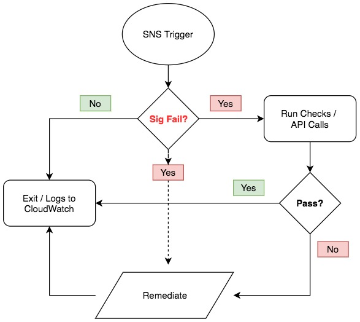

# Auto-Remediation via Lambda

A core design goal and philosophy at **Evident.io** is to provide our customers the most robust configuration security alerting platform on AWS and the remediation guidance to make those alerts actionable. Using our SNS integration, customers can extend that philosophy to make sure alerts are automatically remediated before you, or malicious actors, even know there’s an issue.

For more information including an Auto-Remediation walkthrough, please see [Evident Docs](http://docs.evident.io/#auto-remediation-via-lambda-walkthrough)

## Repo

Directory | Contents
--------- | ---------
lambda    | Auto-Remediation Lambda functions
policies  | IAM Role policies with the necessary permissions to run the corresponding Lambda function

## How it Works...

1. Using the AWS API, **ESP** continuously performs checks against custom signatures and policies.
2. If the resulting analysis determined a signature did not pass, send the failed alert to AWS **SNS** via ESP integrations.
3. The AWS SNS service triggers the workflow and launches the AWS **Lambda** auto-remediation function.
4. Using the AWS API, **Auto-Remediate** and fix the offending issue.
5. Send the resulting logs to AWS **CloudWatch**.

For more information on ESP integrations, please see [Evident Docs](http://docs.evident.io/#integrations)
